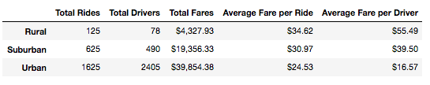
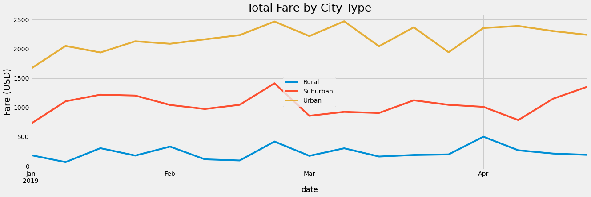

# PyBer-Analysis

## Project Overview

The purpose of this project was to assist a python-based, ride-sharing app company called “Pyber” in understanding and visualizing trends in previously collected ride-sharing data so that the company may implement this acquired knowledge for improving resource allocation decisions.

To perform the analysis, two CSV files, one of "city data" and the other of "ride data", were merged and analyzed using a variety of dependencies within a Jupiter notebook using python programming language.  The merged data was then split into three new DataFrames based on “city type” to compare how urban, suburban, and rural areas correlated with the total and average number of fares, total and average number of rides, and the total and average number of drivers in each city type.  This process involved exploratory data analysis techniques, the creation of statistical summaries, and the incorporation of a wide variety of charts to aid the company in visualizing trends.

---------------------------------------------
## Resources:
Data Sources: city_data.csv, ride_data.csv

Software: Python 3.8.3, Visual Studio Code 1.49.2, 
Matplotlib 3.2.2, Numpy 1.18.5, Pandas 1.0.5, PySci 1.5.0

---------------------------------------------

## Results:

As a result of the analysis, it is clear that city type (urban, suburban, or rural) had an affect on the totals and averages regarding fares, rides, and drivers.  For instance, the average fare, both per ride and per driver, were lower in the urban cities than otherwise.  On the other hand, the urban cities had more total drivers and riders overall which produced more total revenue in fares than rural and suburban cities combined.  Interestingly, the rural areas produced the highest fare per driver.  Also, the urban cities were unique in that they exhibited more total drivers than total rides.

-----------------------------------------------

----------------------------------------------

Next, we can see the total fare by city type in the multiple-line graph below, displaying weekly data trends from January through April according to each city type.  Again, you can see that, overall, urban areas produced the most fares and rural areas produced the least.  This is not surprising as it corresponds to the difference in city types for the number of total rides and total fares we saw from the previous table.  However, what this line graph uniquely shows (which the previous table did not) is how the fares changed over time.  For instance, we see there is a shared spike for all graphs near the week right before March, followed by a shared dip in fares when march began.  This may warrant further research in determining the cause of the shared trend among all three city types.  Also, urban and suburban areas at the end of April seem to have slightly higher fare revenue overall than at the start of January, whereas rural fares did not share this increasing trend. 

------------------------------------

-----------------------------------

## Summary

From these findings, a variety of interesting insights emerge that may warrant attention from Pyber for determining how to best allocate resources in the future.  Given that the total fares in rural areas was the lowest of all city types, one might assume that serving rural areas are a bad investment.  However, unlike cities that are more urbanized, the data shows there were actually more rides than total drivers in rural cities which indicates it may be worthwhile to invest in more drivers specifically for rural areas as it appears to be an underserved area in comparison to urban cities.  Likewise, suburban areas also appear to have less drivers than rides and thus may beneift from having more drivers as well.  In contrast, urban areas may have a surplus of drivers and some of those drivers may be better suited relocating to serve urban and suburban areas instead.

Secondly, there appears to be a spike in fares, shared by all three city types on the week before March.  Investing in research to understand the cause of this shared spike trend among all three city types may be worth investigating since undersanding the causes for this spike could aid Pyber in adjusting their business model accordingly.  For example, suppose there is an annual event occuring in this geographic area causing the spike for the need of ride-sharing services in all three city types.  If Pyber learns how this spike may be correlated to this annual event, it may be advantageous to incorporate this knowledge into an adjusted plan for better serving customers around the event.

Finally, since Pyber drivers in urban areas have the most rides but are recieving less fares per driver, it may be beneficial for Pyber to raise fares for urban areas as this could increase the average fare per driver, the average fare per ride, as well as the total fares for urban cities overall.  Of course, if the fares are raised too high, this affect could have its limitations but it may at least be worth raising the price incrementally until the affect is no longer beneifical.  In any case, now that Pyber not only has a means to visualize results of past perfomrance data but also a method that can be retested in the future, this will allow the company to continously adjust its sails for best serving each city type and its own business needs simultaneously.

## Limitations:

It is important to note, for this analysis we were limited in our knowledge of the Pyber company and had to make some generic assumptions.  For example, we were not given information about how Pyber calculated fares for charging customers or where most Pyber drivers were located prior to being called for service.  These variables could have a drastic affect on determining how to appropriately interpret the data.  However, since these variables were unknown, for this analysis we operated under the assumption that Pyber drivers are most heavily populated in the urban areas and that every Pyber driver charged the same amount per mile, beginning with the location of the pickup and ending at the dropoff destination.